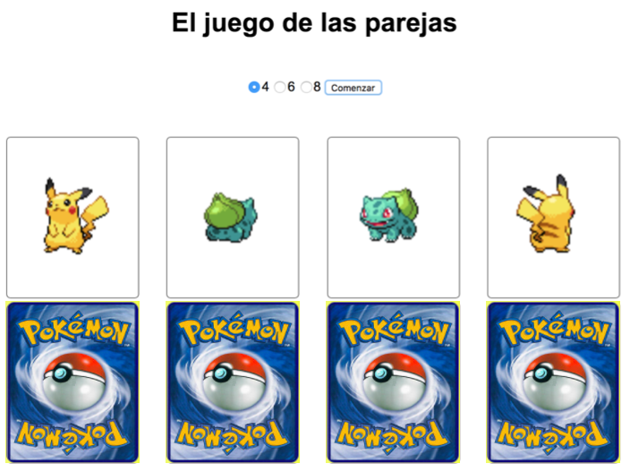
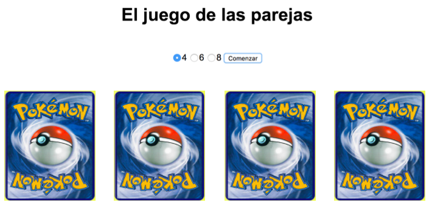

# JavaScript - Ejercicio 3

[AQUÍ](https://palomaviolin.github.io/javascript__exercise-3__perfect-match/) podéis encontrar el link directo a la website resultante, y a continuación pondré en detalle las instrucciones que nos dieron para realizar dicho ejercicio. Finalmente añadiré una guía para usar este repo el cual contiene un web-starter-kit en node/gulp.


# Instrucciones dadas para realizar el ejercicio:

El ejercicio consiste en desarrollar una aplicación web que simula un juego de buscar las parejas. El objetivo del ejercicio es desarrollar la interfaz del juego, **no implementar el juego en sí** que quedará como un BONUS.

Antes de empezar, tenéis que crear un nuevo repositorio desde GitHub Classroom usando este enlace. Una vez creado, lo clonamos en nuestro ordenador y en la carpeta creada empezaremos a trabajar en el ejercicio.

Vamos de definir los distintos hitos del ejercicio:

## 1. Maquetación

En primer lugar vamos a realizar una maquetación básica del juego.



La aplicación consta de dos partes:
1. Un formulario para elegir el tamaño de la partida y un botón.
2. Un listado de cartas, cada una con 2 imágenes que representan las dos caras de una carta ﴾cuando una está visible la otra está oculta﴿.

La imagen para la cara anterior la obtendremos de un servidor y para la posterior usaremos
https://via.placeholder.com/160x195/30d9c4/ffffff/?text=ADALAB.

En la imagen del el diseño propuesto podemos ver algunas cartas boca arriba y otras boca abajo.

Para realizar la maquetación básica del ejercicio usaremos Sass y la base de gulp del [Adalab Web Starter Kit](https://github.com/Adalab/Adalab-web-starter-kit).

## 2. Inicio de la partida

Al hacer clic sobre el botón de 'Comenzar', nuestra aplicación debe recoger el valor del tamaño de la partida y conectarse a un API que devuelve un listado de cartas. La URL del API es https://raw.githubusercontent.com/Adalab/cards-data/master/NUMERO.json, donde NUMERO puede tomar el valor de 4, 6 y 8. Por cada carta obtendremos, entre otros datos, la URL de la imagen a mostrar. También vamos a guardar este número en localStorage, de forma que al recargar la página aparezca seleccionado el número que se eligió la última vez.

## 3. Interacción

Una vez mostramos el listado de cartas vamos a hacer que el listado sea interactivo. Para eso, lo primero que haremos será ocultar la parte frontal de las cartas mostrando solo la parte de atrás.



Al hacer clic sobre una carta vamos a mostrar su parte frontal y a ocultar su parte trasera. Al volver a hacer clic haremos la operación contraria, y volveremos a ver su parte trasera y ocultar la frontal.


## 4. BONUS: Implementar el juego

Una vez terminada la parte obligatoria, os animamos a intentar implementar el juego de las parejas en una rama del repositorio. Por cada carta, tenemos información en el JSON de cuáles son pareja.

- Cuando se hace clic en una primera carta esta se da la vuelta y nos muestra su pokemon ﴾como hasta ahora﴿.

- Al hacer clic en una segunda carta esta se da la vuelta y: si es la pareja de la primera las dos se quedan boca arriba ﴾como hasta ahora﴿, si no es la pareja de la primera las dos deben mantenerse visibles durante un periodo corto de tiempo ﴾para que la usuaria vea los pokemon﴿ y ponerse boca abajo.

Esta parte del ejercicio es bastante compleja, así que no os desesperéis si no conseguís completarla.

## Criterios de evaluación

Vamos a listar los criterios de evaluación de este ejercicio. Si superas más del 80% de los criterios, estás aprendiendo al ritmo que hemos pautado para poder afrontar los conocimientos del siguiente sprint.

### Control de versiones

- Uso de control de versiones con ramas para nuevas funcionalidades

### JavaScript básico

- Crear código JavaScript con sintaxis correcta, bien estructurado e indentado Usar variables para almacenar información y re-asignar valores.
- Usar condicionales para ejecutar acciones distintas en función de una condición Saber recorrer listados de datos para procesarlos.
- Usar funciones para estructurar el código.
- Saber modificar la información del DOM para añadir contenido dinámico Saber escuchar eventos del DOM y actuar en consecuencia.

### AJAX y APIs

- Crear peticiones con fetch y promesas.
- Gestionar información en formato JSON.
- Usar el localStorage para guardar información en el navegador.

# Guía para usar este repositorio

Este repo es incluye un [web-starter-kit](https://github.com/Adalab/Adalab-web-starter-kit) en node/gulp.
Incluye SCSS, un sistema de plantillas HTMl y un web server.
Necesitarás instalar [Node.js](https://nodejs.org/) y [Gulp](https://gulpjs.com) para trabajar con este Starter Kit, luego:
1. Descarga o clona el repositorio
2. Instala las dependencias locales con `$ npm install`
3. Arranca el kit con `$ gulp`

## Espera, ¿esto se hace siempre?
> ### Solo una vez al principio en cada ordenador que utilicemos:
- Instalamos node
- Instalamos el comando de gulp de forma global para poder usarlo desde cualquier carpeta usando `npm install --global gulp-cli`

> ### Cada vez que descarguemos o clonemos un repo:
- `npm install` para instalar los paquetes necesarios para convertir Sass a CSS, minizarlo, etc.

> ### Cada vez que estemos trabajando con nuestro código:
- Desde nuestra terminal, ejecutamos el comando `gulp` para que realice la tarea por defecto, que en el caso del `gulpfile.js` que tenemos en adalab-web-starter-kit estará pendiente de nuestros archivos Sass, html y JavaScript y los compilará, minificará y/o recargará el servidor cada vez que hagamos un cambio

## Tareas de gulp incluidas
### Inicio de un web server para desarrollo
```
$ gulp
```
Lanza un webserver con BrowserSync y varios watchers estarán pendientes de los archivos SCSS/JS/HTML, en la carpeta **public/**, para recargar el navegador cuando se necesite.

### Versión lista para subir a producción
```
$ gulp docs
```
En la carpeta **docs/** genera los CSS y JS minimizados y sin sourcemaps listos para subir al repo y activar GitHub Pages en `master/docs`.


## Estructura del proyecto
Nuestro **gulpfile.js** usa un JSON de configuración con las rutas de los archivos a generar/vigilar.

La estructura de carpetas tiene esta pinta:
```
/
`- _src
   |- assets
   |  |- icons
   |  |- images
   |  |- js
   |  `- scss
   |     `- core
   |
   `- templates
      `- partials

```

## HTML
Viene incluído el paquete [**gulp-html-partial**](https://www.npmjs.com/package/gulp-html-partial) que nos va a permitir tener un sistema de plantillas html

## Imágenes e iconos
Tenemos en **_src/** una carpeta para las imágenes del proyecto y una para los iconos como el favicon o los iconos de dispositivos móviles. Estos últimos se generan en la raíz de las carpetas **public/** y **docs/**

## CSS
Viene incluído el paquete [**gulp-combine-mq**](https://www.npmjs.com/package/gulp-combine-mq) que agrupa todas las mediaqueries al final del documento css.

## JS
Podemos usar parciales de JS: en el JSON de configuración, **config.json** especificamos los archivos JS que utilizamos y en el orden que deben procesarse.
